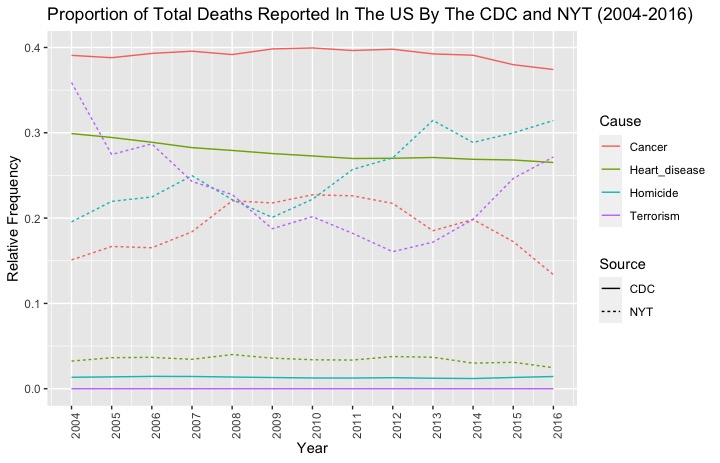

# US-cause-of-death-prevalence (May 2022)

The goal of this project was to use 3 datasets to compare the actual vs. perceived prevalence of different causes of death in the US from 2004-2016. 

1) The CDC dataset contained data of actual causes of death in the US. 
2) The Google dataset contained search data for causes of death in the US. 
3) The NYT datasets contained the reporting frequency of different causes of death in the US in the NYT. 

We can treat the CDC data as data for the actual prevalence of causes of death in the US. Furthermore, the NYT dataset can be treated as a proxy for the portrayed prevalence of causes of death in the US in the news media. Similarly, the Google dataset can be treated as a proxy for the perceived prevalence of different causes of death in the US public. 

The graphs indicate that the US news media therefore reports the less-prevalent causes of death disproportionately more. In particualr, cancer and heart disease seem to be the leading true causes of death in the US from 2004-2016. However, this prevalence is not refelcted in the reporting by the news media. Furthermore, the news media reports deaths due to terrorism and homicide very frequently, despite the fact that they make up only a small portion of actual deaths. 

